# Donato Colombini

_**Nota**: I dati sono aggiornati alla monografia del 2013_

## Indice

- [Il Profilo](#profilo)
- [Il Gruppo](#il-gruppo)
  - [Il Settore Immobiliare](#il-settore-immobiliare)
  - [L'Impresa](#limpresa)
  - [La Commercializzazione](#la-commercializzazione)
  - [Il Settore Terziario](#il-settore-terziario)
  - [Il Settore Agricolo](#il-settore-agricolo)
- [I Progetti](#i-progetti)
  - [Immobiliari](#immobiliari)
  - [Impresa](#impresa)
  - [Commercializzazione](#commercializzazione)
  - [Settore Terziario](#settore-terziario)
  - [Settore Agricolo](#settore-agricolo)
  - [In Fase di Sviluppo](#in-fase-di-sviluppo)
- [Le Iniziative Umanitarie](#le-iniziative-umanitarie)

---

## Profilo

|  |
| :----------------------------------------------------------------: |
|                  **Architetto Donato Colombini**                   |

Nato a Ospedaletto Lodigiano il 28 Luglio 1938 abita a Milano.
Laureato al Politecnico di Milano a pieni voti.
È iscritto all’ordine degli architetti di Lodi.
\
Sposato con Cettina Tummolo dalla quale ha un figlio, [Marco](#dott-marco-colombini--amministratore-unico).

Dal 1967 al 1983 è stato Direttore Generale ed Amministratore Delegato di uno dei più importanti consorzi edilizi italiani.

Sotto la sua direzione sono stati realizzati in varie città d’Italia, soprattutto a Milano, circa [22.000 alloggi](#i-progetti).

Dal 1978 al 1980 è stato vicepresidente di una federazione di società operanti nel settore edilizio e ne ha curato le programmazioni con particolare riguardo alle localizzazioni ed ai finanziamenti per gli interventi abitativi.

Ha collaborato alle attività di ricerca presso la cattedra di Estimo ed esercizio professionale della Facoltà di Architettura di Milano.

È stato coordinatore e amministratore di società che hanno realizzato importanti e significativi quartieri in Milano e in Roma.

Ha progettato autonomamente e in associazione diverse e prestigiose opere edili, compresi significativi complessi nel Comune di Milano.

Dal Maggio 1987 al 1991 è stato membro della Commissione Edilizia del Comune di Milano partecipando ad incontri finalizzati all’approvazione di grandi opere, quali: lo stadio di San Siro, il palazzetto dello Sport, Tecnocity, il Portello (fiera) e altri.

Nel 1981 inizia l’attività imprenditoriale in proprio fondando [il Gruppo](#il-gruppo), da allora direttamente ed in partecipazione con altri partners ha realizzato numerose iniziative immobiliari con diverse destinazioni d'uso.

---

## Il Gruppo

Dal 1981 ad oggi professionalità, dinamismo ed esperienza, contraddistinguono la nostra attività sviluppatasi negli anni attraverso la costituzione di diverse società.

Oggi il gruppo Colombini può contare sul lavoro di diverse figure professionali qualificate.

### Il Settore Immobiliare

#### Euromec Srl

##### Giuseppe Consolini | Amministratore Unico

È la società storica tra le immobiliari del guppo.

Ha realizzato moltissime iniziative di carattere residenziale e oggi continua ad essere il soggetto principale delle numerose attività intraprese sia direttamente che in compartecipazione.

#### Helios Srl

Società in compartecipazione con altri partners è nata con lo scopo di realizzare un complesso di circa 100 appartamenti nel comune di Desio.

Successivamente divenuta anche società di partecipazione.

Dal 2003, oltre ad avere acquistato un importante immobile situato in Via Bellerio a Milano, partecipa anche ad altre società quali R.C.H. 31 Srl ed Helios Property Srl.

Detiene una partecipazione di maggioranza nella società Biancamano Srl.

#### Biancamano Srl

Società in compartecipazione con lo scopo principale di acquisire l’immobile sito a Milano in piazzale Biancamano 2.

#### Lombardini Srl

##### Dott. Angelo Cardani | Presidente CdA

Società, in compartecipazione con il Gruppo Cardani, specializzata per cultura e tradizione nelle attività di recupero e ristrutturazione.

Ne sono testimonianza gli interventi realizzati in via Savona e in via Cadolini sull’edificio delle società Kores e il lavoro svolto sull’ex area Richard Ginori.

Oggi, oltre a consolidare questi risultati, gestisce immobili di grande standing e prestigio nel tessuto archittettonico della città, quali l’edificio storico di via Sassi 2, uno dei più significativi immobili di Milano prospicente il Chiostro di Santa Maria delle Grazie di corso Magenta, recentemente acquisito, e un immobile in corso di ristrutturazione in corso di Porta Vercellina.

### L'Impresa

#### G. Edil Srl & G. Edil Costruzioni Srl

Nel 1981 viene costituita la G. Edil Srl che nel corso degli anni ha realizzato centinaia di appartamenti, lasciando successivamente il testimone alla G. Edil Costruzioni, alla [Eurodomus Co](#eurodomus-co-srl). e alla [Eurodomus Costruzioni Co](#eurodomus-costruzioni-co).

#### Eurodomus Co. Srl

##### Dott. Marco Colombini | Amministratore Unico

Eurodomus Co ha operato per quasi 20 anni, da protagonista riconosciuta, durante l’importante fase di sviluppo edile che ha contraddistinto il territorio milanese.

Grazie all’impegno ed al lavoro profuso, numerose famiglie hanno potuto apprezzare la qualità ed il valore delle nostre realizzazioni.

#### Eurodomus Costruzioni Co

##### Geom. Alberto Zamperoni | Amministratore Unico

Eurodomus Costruzioni Co. è il punto di arrivo di un’esperienza maturata in più di quarant’anni nel settore delle costruzioni.

Oggi la società rappresenta la piattaforma per l’espansione dell’attività del Gruppo grazie alla struttura organizzativa che mantiene caratteristiche di grande flessibilità, garantisce la realizzazione di un prodotto competitivo e di alto livello.

### La Commercializzazione

#### Abitare Co. Srl

##### Rag. Giuseppe Crupi | Amministratore Unico

Nel 1987 nasce una nuova società del Gruppo: AbitareCo Srl.

I soci fondatori, nelle persone di Donato Colombini, Giuseppe Crupi e Giuseppe Consolini, muovendo da un’esperienza quarantennale nel settore immobiliare, hanno rivolto una particolare attenzione all’edilizia residenziale e di nuova costruzione proponendosi l’obiettivo di offrire ai clienti, imprese e cooperative un servizio specializzato in grado di garantire il miglior risultato possibile.

Professionalità, competenza, affidabilità e puntualità è il costante investimento che, da anni, ripagano la società con la fiducia dei suoi interlocutori.

AbitareCo propone servizi personalizzati alle esigenze del cliente utilizzando strumenti capaci di gestire, in tempo reale, una banca dati costantemente aggiornata.

Nell’offerta al pubblico è contemplata la sensibilizzazione sulle questioni riguardanti l’abitazione poiché è nella comprensione delle problematiche relative all’acquisto che la società offre la sua esperienza mettendo il cliente in condizione di affidarle la sua fiducia.

AbitareCo garantisce nei confronti del costruttore la sicurezza dell’intervento, stabilendo la fattibilità ancor prima dell’acquisto dell’area. Consente inoltre, grazie alla vendita su
carta, un’efficace gestione finanziaria dell’investimento.

Tra i servizi offerti alle imprese, ai privati e alle aziende propone ricerche di mercato, individuazione di aree edificabili, studi di fattibilità, progettazione e consulenza in risposta alla esigenze di mercato, gestione dei cantieri e degli extra capitolato, assistenza per mutui, leasing e finanziamento all’impresa, valutazioni, stime, consulenze, vendite, locazioni, gestione e ottimizzazione del patrimonio, costituzione e gestione di cooperative edilizie, assistenza finanziaria per mutui, cessione e affitto di aziende, assistenza per leasing aziendale.

### Il Settore Terziario

#### Sillaro Spa

##### Piero Peveralli

All’inizio del 1968 viene costituita da un gruppo di giovani imprenditori lodigiani, la Sillaro SpA industria di produzione di prodotti quali fusti e fustoni per uso commerciale ed industriale.

Con il fustino salvaspazio è stata leader di mercato ed ha fornito in via esclusiva società quali Lever Gibs, Henkel e Panigal.

Grazie ad un costante processo di rinnovamento, di conversione e di installazione di nuovi impianti per la produzione e la lavorazione del materiale, la Sillaro Spa è oggi in grado di offrire ai propri clienti una vastissima gamma di produzioni per tutte le tipologie del cartone.

#### Eurowindoor Srl

Azienda specializzata nella progettazione, produzione e installazione di serramenti e opere specialistiche di carpenteria metallica.

Opera nei mercati residenziale, industriale e terziario realizzando serramenti in alluminio, alluminio-legno, facciate continue, frangisole, porte per interni, oltre a scale, pensiline, tettoie e lavorazioni in ferro su progetto.

#### Utiliteam srl

##### Ing. Giuseppe Sbarbaro | Amministratore Unico

Società di consulenza specializzata nel settore Energy&Utilities al quale si rivolge in modo prevalente Utiliteam offre una vasta gamma di soluzioni su misura per le esigenze di ogni Cliente.

Fornisce servizi di consulenza a elevato valore aggiunto su tematiche strategiche, societarie, economiche, aiutando le società Clienti ad affrontare le sfide strategiche dell'organizzazione aziendale e a trasformare gli obblighi imposti dalle normative nazionali ed europee in strumenti di crescita.

Utiliteam, costituita nel 2004 da professionisti affermati e con solida esperienza, sia nel settore che nell'attività di consulenza, opera attraverso le proprie sedi di Milano e Padova.

Utiliteam ha scelto di rivolgersi in modo prevalente alle società del settore Energy&Utilities offrendo loro una vasta gamma di servizi, dalla puntuale verifica della compliance normativa arrivando alle sfide strategiche dell'organizzazione complessa.

L'offerta Utiliteam è modellata sulle esigenze delle società del settore Energy&Utilities.

Settore dove sono all'opera player internazionali, ma anche aziende più vicine, per dimensioni e approccio, alla realtà locale.

Per questo, Utiliteam è in grado di offrire, grazie alla vasta gamma di servizi, un approccio customizzato, dalla puntuale verifica della compliance normativa arrivando alle sfide strategiche dell'organizzazione complessa.

### Il Settore Agricolo

Un’ulteriore diversificazione delle attività del gruppo non poteva prescindere da importanti investimenti nell’ambito agricolo.

#### DodiciEttari

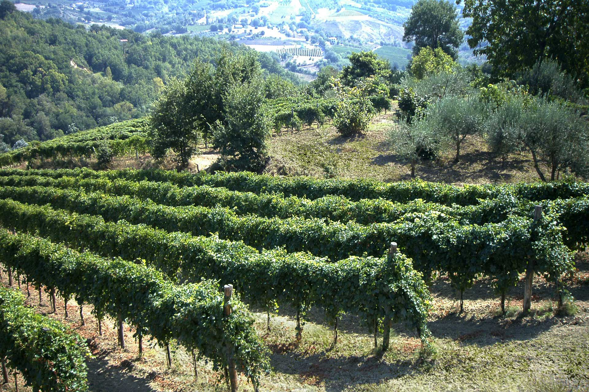

L’azienda è situata in provincia di Avellino.

Dei 12 ettari in proprietà circa 9 sono di Superficie Agraria Utilizzata (SAU).

Il lavoro in vigna è svolto con grande cura ed attenzione affinché l’uva prodotta sia materia prima eccellente per i nostri prodotti.

Dal 2009 commercializziamo i nostri vini con il marchio DODICIETTARI.

L’attuale produzione è di 50.000 bottiglie annue, ma prevediamo di raggiungere le 150.000 bottiglie all’anno, attraverso una mirata programmazione degli investimenti e della commercializzazione.

La nostra passione, il nostro entusiasmo, la nostra terra, il nostro lavoro, le nostre vigne, la nostra attenzione ai particolari sono elementi attraverso i quali, siamo certi, DODICIETTARI consoliderà la propria posizione di marchio riconosciuto ed apprezzato nel panorama enologico nazionale.

#### GDS Agroenergia Srl

Società Agricola in compartecipazione dedicata alla produzione di energia.

Dispone di un impianto a biogas da 1 Mw, alimentato con biomassa derivata da trinciato di mais.

---

## I Progetti

### Le Sedi

#### Ospedaletto Lodigiano, Lodi

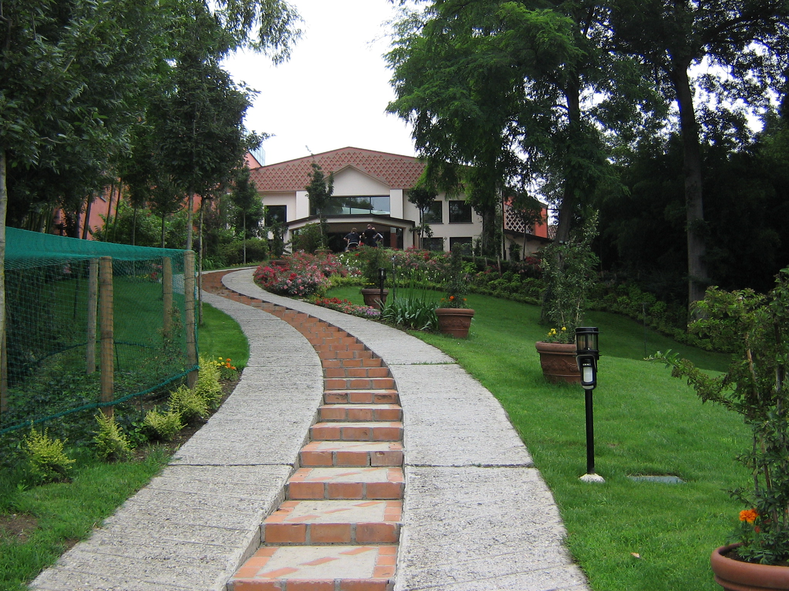

**_Proprietà:_** Arch. D. Colombini
**_Impresa:_** Eurodomus Co. Srl
**_Progettazione e direzione artistica:_** Arch. D. Colombini

##### Corsi di Formazione

Il Gruppo Colombini organizza periodicamente corsi di formazione e aggiornamento professionale per il proprio personale e i suoi partner.

#### Milano, Via Bergognone

**_Proprietà:_** N/A
**_Impresa:_** N/A
**_Progettazione e direzione artistica:_** N/A

### Immobiliari

#### Milano, Alzaia Naviglio Grande, Area Ex Richard Ginori

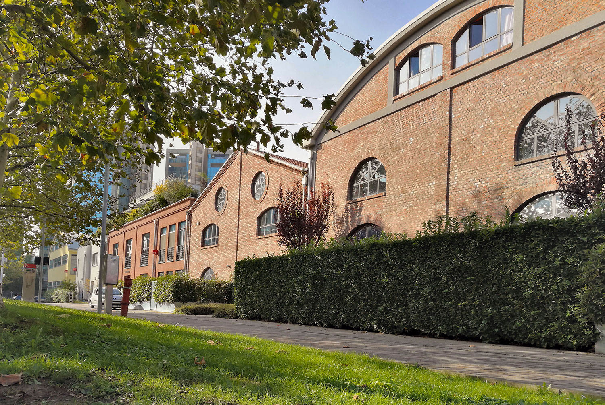

Il complesso ex Richard Ginori occupa un ampio isolato tra via Lodovico il Moro e via Morimondo.

L’edificio originale, una villa suburbana del Settecento, fu acquistato nel 1809 e convertito in stabilimento industriale usando le acque del Naviglio come forza motrice. Nel 1830 la fabbrica fu adattata da Gindrand e Billet alla produzione di ceramiche. Nel 1846 la ditta assorbì l’attività per la produzione di ceramica toscana della famiglia Ginori e prese il nome di “Società Ceramica Richard Ginori”.

Dal 1879, anno nel quale Augusto Richard fu chiamato alla direzione tecnica, la fabbrica acquistò sempre più rilievo a livello europeo e la produzione continuò con successo anche dopo la seconda guerra mondiale.

Nel 1986, per le profonde trasformazioni economiche che interessarono il sistema metropolitano, lo stabilimento venne dismesso.

Nell’affrontare il tema attuale di recupero e trasformazione di un’area industriale dismessa ma con un passato produttivo importante ed articolato abbiamo voluto conservare il più possibile le diversità architettoniche dei singoli edifici.

La memoria industrale diventa un valore aggiunto al progetto che, pur conservando i volumi, apre nuove corti e giardini al fine di garantire caratteristiche di illuminazione, salubrità e qualità ai singoli ambienti.

Spazi verdi di connessione tra i singoli edifici, gallerie coperte con attività commerciali, servizi comuni, giardini pensili e parcheggi superficiali ed interrati garantiranno possibilità di una nuova qualità urbana ad un’ampia area attualmente abbandonata in una zona ormai limitrofa al centro urbano.

**_Proprietà:_** Società Lombardini Srl in compartecipazione con Gruppo Cardani, Società Officina Creativa Srl in compartecipazione con Gruppo Martignoni.
**_Progettazione:_** Arch. A. Castiglione, Arch. V. Cosmelli, Arch. L. Clavarino, Arch. M. Doerrie
**_Supervisione:_** Arch. D. Colombini

#### Lonate Pozzolo, Varese, Via Fiume

**_Proprietà:_** Euromec Srl
**_Impresa:_** Eurodomus Co. Srl
**_Progettazione:_** Arch. D. Colombini, Arch. G. Bonelli
**_Direzione Lavori:_** Studio Ass. Rivolta
**_Appartamenti:_** 40

#### Milano, Piazzale Biancamano 2

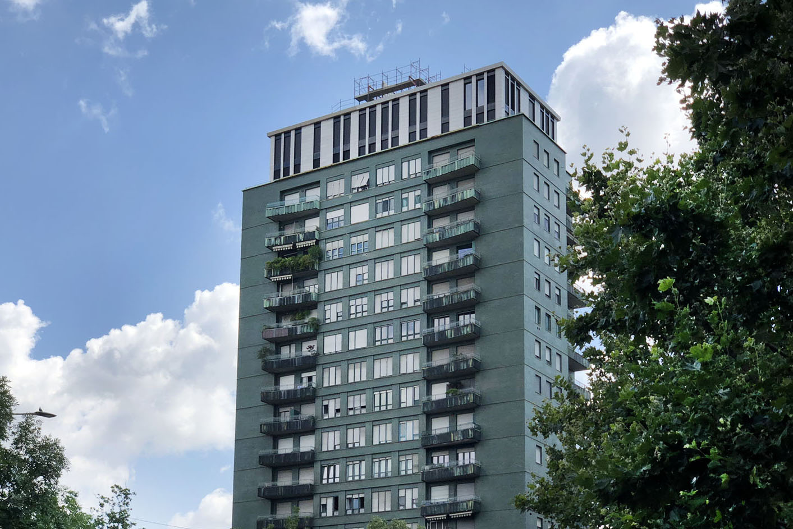

L’immobile è costituito da oltre 100 unità tra appartamenti ed uffici, oltre a negozi e box.

Si tratta di un edificio importante e significativo, situato di fronte all’Arena di Milano, che ha caratterizzato l’archittettura di un'epoca tenuto conto del periodo di costruzione risalente alla metà degli anni ‘50.

**_Proprietà:_** Biancamano Srl
**_Appartamenti:_** 94
**_Negozi:_** 9
**_Box:_** 33

#### Punta Grò, Sirmione, Residenza Aquarius Sirmione

La Società Euromec ha rilevato il complesso turistico di Punta Grò, nei pressi di Sirmione, per trasformarlo nella Residenza Aquarius.

Il progetto di rinnovamento pur conservando l’originaria struttura ha riportato a nuovo tutto il complesso con il massimo rispetto per l’ambiente.

**_Proprietà:_** Euromec srl
**_Impresa:_** Eurodomus Co Srl
**_Unità Abitative:_** 31

#### Desio, Milano, Via Paganini

**_Proprietà:_** Helios Srl
**_Impresa:_** Coemi Srl
**_Progettazione e Direzione Lavori:_** Arch. R. Baioni
**_Appartamenti:_** 80

#### Milano, Via Bellerio

**_Proprietà:_** Helios Srl
**_Ristrutturazione:_** Arch. A. Castiglione, Arch. V. Cosmelli
**_Supervisione:_** Arch. D. Colombini
**_Appartamenti:_** 60

#### Milano, Via Sassi

**_Proprietà:_** Lombardini Srl
**_Impresa:_** Eurodomus Co. Srl
**_Ristrutturazione:_** Arch. A. Castiglione, Arch. V. Cosmelli
**_Supervisione:_** Arch. D. Colombini
**_Appartamenti:_** 16
**_Posti auto:_** 18

#### Milano, Via Cadolini, Ex Società Kores

**_Proprietà:_** Lombardini Srl
**_Impresa:_** Eurodomus Co. Srl
**_Progettazione:_** Arch. D. Colombini, Arch. A. Castiglione
**_Loft:_** 35

#### Milano, Corso di Porta Vercellina angolo Via G.B. Vico

**_Proprietà:_** Lombardini Srl
**_Ristrutturazione:_** Arch. A. Castiglione, Arch. Vasconi
**_Unità Abitative:_** 25

### Impresa

#### San Donato Milanese, Via Spilamberto

**_Proprietà:_** G. Edil Srl
**_Impresa:_** G. Edil Srl
**_Progettazione:_** A. S. Progetti di Arch. D. Colombini, Ing. D. Rubinetti, Ing. G. Giusberti
**_Appartamenti:_** 95

#### Milano, Via W. Ferrari

**_Proprietà:_** Immobiliare Edil Beta
**_Impresa:_** G. Edil Srl
**_Appartamenti:_** 50

#### Gallarate, Varese

**_Proprietà:_** Europrogest Srl
**_Impresa:_** G.Edil Costruzioni Srl
**_Progettazione:_** Arch. Introini
**_Appartamenti:_** 25

#### Milano, Via Ulisse Salis

**_Proprietà:_** G. Edil Srl
**_Impresa:_** G. Edil Srl
**_Progettazione:_** A.S. Progetti di Arch. D. Colombini, Ing. D. Rubinetti, Ing. G. Giusberti
**_Appartamenti:_** 30

#### Muggiano, Milano, Via Lucera

**_Proprietà:_** Eurodomus Co. Srl
**_Impresa:_** Eurodomus Co. Srl
**_Progettazione:_** Arch. Donato Colombini
**_Appartamenti:_** N/A

#### Ponte Sesto, Rozzano, Milano, Via Massimo D’Azeglio

**_Proprietà:_** C.E.C.L. Aler
**_Impresa:_** Eurodomus Co. Srl
**_Progettazione:_** Arch. Cimino
**_Appartamenti:_** 70

#### Milano, Via Adriano

**_Proprietà:_** Coop. La Nuova Europa, Coop. Corcab, Coop. ATM Sarca, Coop. Icaro
**_Impresa:_** Eurodomus Co. Srl
**_Progettazione:_** Arch. Benevento, Arch. Corda, Arch. D’Alfonso, Arch. Giobbe, Arch. Memoli
**_Appartamenti:_** 180

#### Milano Rogoredo Via Cassinari

**_Proprietà:_** Italia Soc. Coop.
**_Impresa:_** Eurodomus Co. Srl
**_Progettazione:_** Arch. Giobbe
**_Appartamenti:_** 50

#### San Donato Milanese, Milano, Via Gramsci

**_Proprietà:_** Coop. Tigullio
**_Impresa:_** Eurodomus Co. Srl
**_Progettazione:_** Ing. B. Zanini
**_Appartamenti:_** 20

#### Sedriano, Milano Viale Donatori di Sangue

**_Proprietà:_** Coop. Solaris
**_Impresa:_** Eurodomus Co. Srl
**_Progettazione:_** Arch. D. Colombini, Arch. G. Bonelli
**_Appartamenti:_** 41

#### Milano, Via Palanzone 16/24

**_Proprietà:_** Coop. Edil. “L’Adda”
**_Impresa:_** Eurodomus Co. Srl
**_Progettazione:_** Arch. M. Santagostino
**_Direzione Lavori:_** Ing. F. Guizzetti, Ing. R. Polovina
**_Appartamenti:_** 240

#### Muggiano, Milano, Via Mosca

**_Proprietà:_** Coop. La Rosa / Coop. Aler
**_Impresa:_** Eurodomus Co. Srl
**_Progettazione:_** Arch. D. Colombini, Arch. G. Bonelli, Arch. F. Vitali **_Appartamenti:_** 110

#### Milano, Via Tortona

**_Proprietà:_** Arch. Donato Colombini SpA
**_Impresa:_** Eurodomus Co Srl
**_Progettazione:_** Arch. D. Colombini, Arch. V. Castiglione

#### Milano, Via Alzaia Naviglio Grande

**_Proprietà:_** Arch. Donato Colombini SpA
**_Impresa:_** Eurodomus Co Srl
**_Progettazione:_** Arch. D. Colombini

#### Milano, Via Maspero

**_Proprietà:_** Cooperativa Teabaldo
**_Impresa:_** Eurodomus Costruzioni Co Srl
**_Progettazione_** Arch. D. Colombini, Arch. Valentino Piazzi

#### Milano, Via Ornato

**_Proprietà:_** Immobiliare Ornato Srl
**_Impresa:_** Eurodomus Costruzioni Co. Srl
**_Progettazione_** Arch. Fantini, Arch. Ferrari
**_Unità Abitative:_** 120

#### Milano, Muggiano Via Monti

**_Proprietà:_** Eurodomus Costruzioni Co. Srl
**_Impresa:_** Eurodomus Costruzioni Co. Srl
**_Progettazione_** Arch. D. Colombini
**_Appartamenti:_** 50

#### Milano, Via Santander

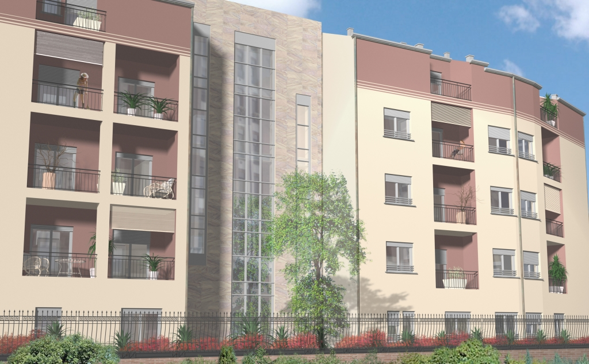

**_Proprietà:_** Euromec Srl
**_Impresa:_** Eurodomus Costruzioni Co. Srl
**_Progettazione_** Studio STG, Milano
**_Appartamenti:_** 50

### Commercializzazione

#### Cerro Maggiore, Via di Vittorio ang. Via IV Novembre

##### Cerro Green

L’intervento edilizio è composto da ville bifamiliari e palazzine di 3 piani con appartamenti di varie soluzioni abitative. 1-2-3-locali con giardini privati e taverne, ampi balconi e tetti verdi.

Il nuovo complesso residenziale, in edilizia convenzionata con il Comune di Cerro Maggiore, è stato sviluppato con caratteristiche
innovative per favorire vivibilità, qualità degli spazi e risparmio energetico.

La particolare concezione della costruzione e dell’allestimento degli edifici è stata studiata per creare un ambiente più salubre adottando materiali e tecnologie che rispettino l’ambiente e minimizzino gli sprechi di energia.

**_Proprietà:_** Mangiavacchi Pedercini SpA
**_Impresa:_** Mangiavacchi Pedercini SpA
**_Progettazione:_** Studio Arch.Massetti
**_Appartamenti:_** 70

#### Cusago, Via Baggio

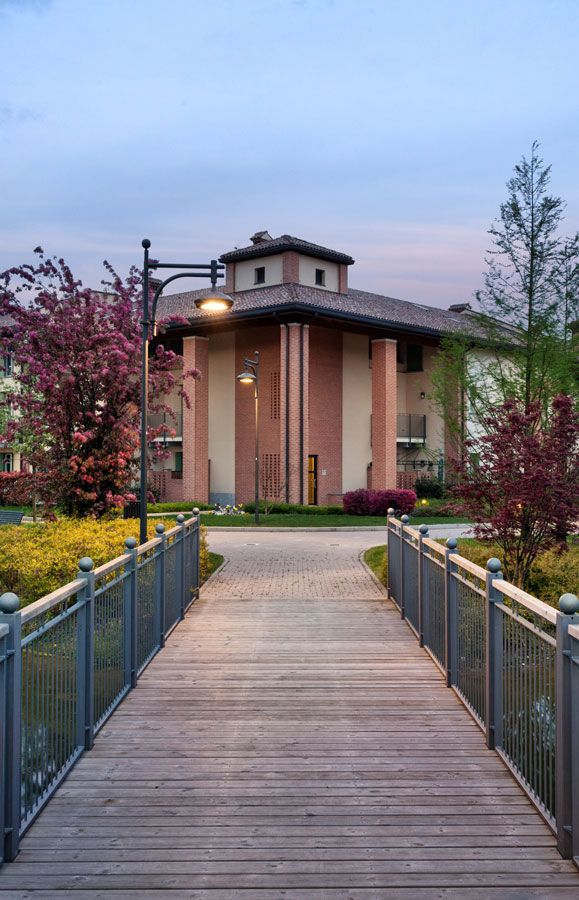

##### Fontanile Visconti

L’intero progetto prende spunto dall'osservazione delle corti rurali di Cusago e del suo territorio: così le valenze positive del sapere costruttivo tradizionale si uniscono alle risorse e alle possibilità delle tecnologie più innovative.

Gli edifici sono di due soli piani per mantenere lo stile architettonico che richiama
le vecchie corti rurali presenti sul territorio di Cusago.

Completano il quadro alberature in linea, macchie boschive e arbustive, radure e al centro un bellissimo specchio d'acqua che ha funzione paesaggistica e ambientale. 90 splendidi appartamenti, tutti diversi tra loro: l’unicità, infatti, è un alto valore aggiunto di questa iniziativa.

**_Proprietà:_** Immobiliare Visconti Srl
**_Impresa:_** Soc. CO.E.RI Costruzioni Srl
**_Progettazione:_** Studio Linea Associati
**_Appartamenti:_** 47

#### Lainate, Via A. Manzoni

##### Residenza Il Parco

Si tratta di un intervento di riqualificazione della storica area della “Trafileria” a Lainate in Via Manzoni.

Il progetto prevede, per il primo lotto, la realizzazione di quattro edifici residenziali di nuova costruzione con spazi commerciali, oltre alla creazione di una nuova piazzetta e di un parco di circa 14.000 mq con percorsi pedonali e aree adibite a giochi per bambini.

Il tutto per garantire uno spazio di benessere ai residenti.

**_Proprietà:_** Tielle Costruzioni Srl
**_Impresa:_** Borio Mangiarotti
**_Progettazione:_** Progettisti Associati-Architettura e Infrastruttura Arch. Sillano
**_Appartamenti:_** 70

#### Rogoredo Montecity, Milano

##### Residenza Montecity

L’intervento sorge in un complesso che ospiterà infrastrutture di interesse pubblico: un vasto parco, un campus scolastico, parcheggi, residence, alberghi ed un centro congressi nel cuore dell’area.

L’edificio è ubicato lungo la promenade pedonale che riqualifica l’impianto urbano per il suo design innovativo.

Qualità, eleganza e funzionalità abiteranno i vostri spazi.

**_Proprietà:_** Varie Cooperative
**_Impresa:_** Eurodomus Co Srl
**_Progettazione:_** P.I.I. Arch. N. Foster
**_Edifici:_** Arch. A. Giobbe, Arch. P. Caputo
**_Appartamenti:_** 260

#### Milano, Via Murialdo angolo Via Lorenteggio

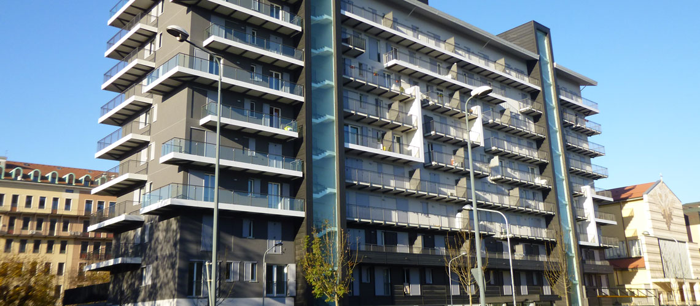

##### I Giardini di Via Inganni

La scelta di una grande qualità di vita in un immobile certificato ad alta tecnologia con elevato risparmio energetico.

La nuova residenza “I giardini di via Inganni” è situata in una tranquilla posizione, a ridosso dell’intersezione tra le vie Inganni e Lorenteggio, primarie strade di comunicazione tra il centro di Milano e i grandi centri commerciali dell’hinterland.

La zona è ottimamente servita da numerosi mezzi di trasporto, tra cui la linea 1 della Metropolitana, fermata Inganni, e la futura linea 4 che arriverà presso la vicinissima stazione di San Cristoforo FS.

**_Proprietà:_** Parcheggi Direzionali Srl
**_Impresa:_** Borio Mangiarotti
**_Progettazione:_** Progettisti Associati-Architettura e Infrastrutture, Arch. Sillano
**_Appartamenti:_** 31

#### Milano, Viale Cassala 55

##### Residenza Cassala 55

È stata progettata in modo da coniugare funzionalità ed eleganza in armonia con la percezione volumetrica della via migliorandone la qualità architettonica.

La filosofia è quella di garantire il benessere, alti standard di efficienza e creare degli alloggi capaci di interpretare differenti stili di abitare utilizzando materiali e soluzioni tecnologiche di altissimo livello in grado di ottenere la massima classificazione energetica e di migliorare la vivibilità delle abitazioni sempre prestando la massima attenzione alle esigenze dell’individuo.

**_Proprietà:_** Soc. Malco Srl
**_Impresa:_** Mangiavacchi Pedercini SpA
**_Progettazione:_** Studio Arch. Degli Esposti
**_Appartamenti:_** 26

#### Milano, Viale Caldara 38

NB: _Da Non Inserire_

A pochi minuti da Piazza Duomo, nel centro storico della città, situato fra Piazza Cinque Giornate e Porta Romana, nasce la nuova residenza Caldara 38, un immobile dalle caratteristiche uniche.

Una rara opportunità per chi desidera vivere e godere di tutti i privilegi e le comodità dell’abitare nei pressi del centro della città, comodamente servito da numerosi mezzi pubblici di superficie e dalla metropolitana.

**_Proprietà:_** GIUMA Srl
**_Impresa:_** GIUMA Srl
**_Progettazione:_** Studio Arch. Belgioioso
**_Appartamenti:_** 28

#### Milano, Via Cena 23

Si tratta di un edificio di nuova realizzazione che sorge a Milano in zona Porta Vittoria, adiacente al parco Marinai d’Italia e vicino a piazza Grandi, in un’area caratterizzata da nuovi servizi e infrastrutture.

La grande attenzione posta nella scelta dei materiali di costruzione e del sistema di riscaldamento e condizionamento, l’alto grado di isolamento acustico, le grandi superfici a terrazzo per vivere la casa anche all’aperto rappresentano oggi un investimento, e certo non soltanto dal punto di vista economico.

**_Proprietà:_** N/A
**_Impresa:_** Borio Mangiarotti
**_Progettazione:_** Studio Arch. Anna Giorgi & Partners
**_Appartamenti:_** N/A

#### Milano, via Zuretti 55

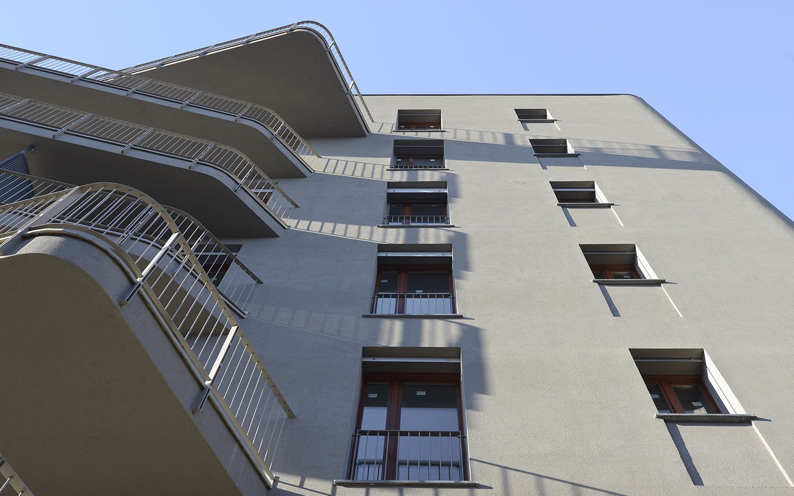

Le Soc. Borio Mangiarotti e Botta Spa in collaborazione con lo Studio Architettura M2P Associati, hanno unito la loro esperienza e professionalità per realizzare il nuovo complesso residenziale Zuretti 55.

Il progetto prevede la realizzazione di un edificio con uno stile architettonico moderno e innovativo, certificato in classe A, secondo le normative vigenti in materia di certificazione energetica.

**_Proprietà:_** Borio Mangiarotti
**_Impresa:_** Borio Mangiarotti
**_Progettazione:_** Studio M2P Associati
**_Appartamenti:_** 26

#### San Donato Milanese, Via Piave angolo Via Greppi

Questo complesso residenziale certificato classe “A”, è collocato a ridosso della Via Emilia, in una zona ben servita da attività commerciali e da mezzi pubblici.

Ogni appartamento è dotato di pannelli radianti sottopavimento, attraversati da acqua calda nella stagione invernale.

I vetri ed i serramenti hanno caratteristiche tali da soddisfare le esigenze di isolamento termico e acustico.

I serramenti sono in legno e sono dotati di zanzariere.

**_Proprietà:_** DASCAL Srl
**_Impresa:_** CO E MI
**_Progettazione:_** Desmos
**_Appartamenti:_** 110

#### Settimo Milanese, Vighignolo, via Don Minzoni

L’ intervento sorge nelle immediate vicinanze della Via Novara, vicino alla tangenziale Milano-Molino Dorino-Settimo Milanese.

Il complesso prevede due lotti: il primo in edilizia convenzionata con il comune di Settimo Milanese per un totale di 120 alloggi; il secondo in edilizia libera per un totale di 122 alloggi, al completamento dell’ intervento verrà realizzata una nuova scuola materna ed un parco che verranno ceduti al comune.

**_Proprietà:_** Alphagreen Srl
**_Impresa:_** Delta Srl
**_Progettazione:_** Arch. Signore, Arch. Capponi, Arch. Monti, Arch. Gatti
**_Appartamenti:_** 242

#### Parabiago, viale Lombardia angolo via E. Fermi

##### Residenza Verde e Piscine

L'intervento è ubicato nelle immediate vicinanze dal centro di Parabiago, in Viale Lombardia angolo via Enrico Fermi, in una zona di forte sviluppo in prossimità della Stazione Ferroviaria.

È composto da piccole palazzine di 5 piani in un contesto altamente residenziale con finiture di pregio e con ampi spazi destinati a verde.

Il complesso è completamente recintato e dotato di piscina e campo da tennis.

**_Proprietà:_** L4-Sip-ICT
**_Impresa:_** ICT SpA
**_Progettazione:_** Arch. Sissa, Arch. Ing. Torretta
**_Appartamenti:_** 350

#### Legnano, Via Napoli angolo via Salmoiraghi, zona Sabotino

##### Giardini d’Acqua

Il complesso è ubicato nelle immediate vicinanze del centro di Legnano, in via Napoli angolo via Salmoiraghi, vicino alla stazione ferroviaria e alle vie di grande comunicazione.

L’ottimale distribuzione degli spazi consente diverse soluzioni abitative da 1-2-3-4 locali con ampi balconi, attici con terrazzi, appartamenti al piano terra con giardino privato, tavernette e ampi parcheggi interrati.

**_Proprietà:_** GIG Scarl
**_Impresa:_** Garantola S.r.l-ICT S.p.A.
**_Progettazione:_** Arch. G. Tenconi
**_Appartamenti_**: 160

#### Settimo Milanese, Seguro, Via Sandro Pertini

##### Residenza Verde Bosco

È un complesso residenziale di nuova costruzione.

Situato a ridosso del centro storico di Seguro, a pochi minuti sia dalle stazioni della MM di Bisceglie e Molino Dorino, sia dalla Tangenziale Ovest uscita Cusago e Settimo Milanese. Si tratta di un insediamento altamente qualificato, integrato con il contesto urbano.

Sono stati realizzati nuovi servizi come la scuola elementare, l’asilo nido, la scuola materna, la palestra, il campo da calcio e la chiesa parrocchiale con l’oratorio.

**_Proprietà:_** Simp Srl
**_Impresa:_** Delta Srl
**_Progettazione:_** Arch. P. Monti, Arch. A. Monti, Arch. Gatti, Arch. M. Engel
**_Appartamenti:_** 350

#### Milano, via Lattuada 9

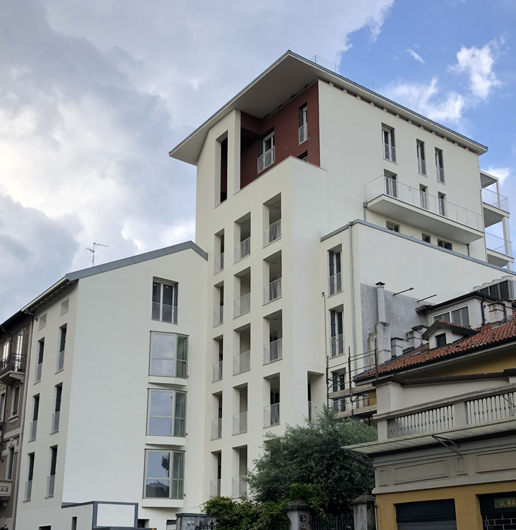

##### Residenza Lattuada 9

In una delle zone più prestigiose di Milano, adiacente a Porta Romana, nasce la nuova residenza Lattuada 9: un esempio di nuova costruzione di prestigio nata dalla fusione tra design e tradizione.

L’obiettivo dell’intervento è quello di realizzare un nuovo edificio che riproponga l’architettura tradizionale pur conservando, nei particolari costruttivi e nelle tipologie dei materiali, il carattere di un’architettura moderna conforme alle necessità urbanistiche e prestazionali tipiche degli edifici attuali.

**_Proprietà:_** N/A
**_Impresa:_** Giuma
**_Progettazione:_** N/A
**_Appartamenti:_** N/A

#### Milano, Via Maestri Campionesi

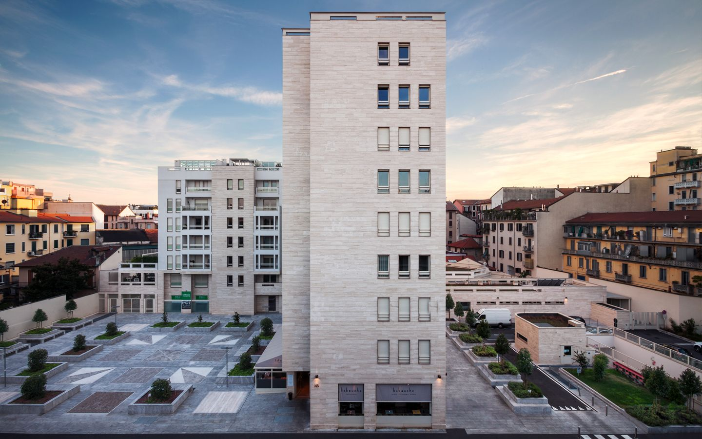

Il progetto si caratterizza per l’elegante forma a “T” che contiene tre edifici residenziali contornati da piacevoli aree a verde ed esercizi commerciali.

L’edificio è stato studiato nei minimi dettagli da un équipe di professionisti che collaborano da anni con un impegno importante nei confronti dell’ambiente, introducendo materiali e tecnologie all’avanguardia, garantendo un notevole risparmio economico, riducendo al minimo le emissioni e gli inquinanti nell’aria.

**_Proprietà:_** Borio Mangiarotti
**_Impresa:_** MR Real Estate
**_Progettazione:_** Studio Luisa Cortese
**_Appartamenti:_** 80

### Settore Terziario

#### Ex Sede Sillaro, Livraga, Lodi

**_Proprietà:_** Sillaro Spa
**_Area:_** mq. 33.000
**_Superficie coperta:_** mq. 12.000
**_Anno:_** 1977

#### Sedriano, Milano, Via Marie Curie, | Eurowindoor Srl

**_Proprietà:_** Eurowindoor Srl
**_Area:_** mq. N/A
**_Superficie coperta:_** mq. N/A

### Settore Agricolo

#### Santa Paolina, Avellino | DodiciEttari

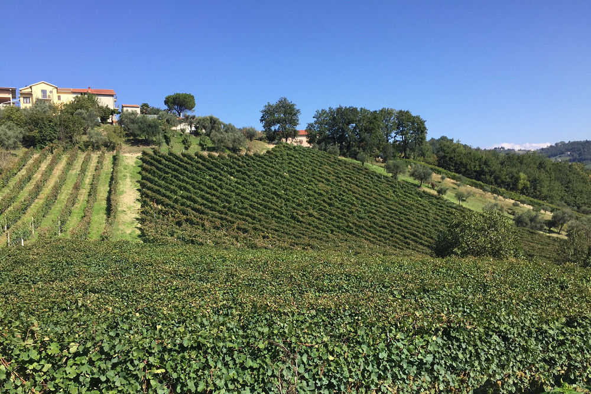

**_Proprietà:_** Vigna dei Lupi Srl
**_Area:_** ha. 12
**_Coltivazione:_** Vigneto

#### Villaggio Gaudiano, Lavello, Potenza

**_In compartecipazione_**

**_Gestione:_** Piani di Federico Srl
**_Area:_** ha. 75 irrigui
**_Coltivazione:_** Mista ad ortaggi

#### Livraga, Lodi | GDS Agroenergia Srl

**_Proprietà:_** G.D.S. Srl
**_Area impianto:_** mq. 20.000
**_Area condotta e coltivata:_** ha. 250

### In Fase di Sviluppo

_**Nota**: I dati sono aggiornati alla monografia del 2013_

#### Murano, Venezia, Ex vetreria De Majo

Progetto per il recupero della zona industriale dell’ex vetreria De Majo.

_Note_: NH Hotel Costruito in quest'area

**_Proprietà:_** Campo San Donato Srl

#### Pemba, Mozambico

Resort in fase di realizzazione a Pemba in Mozambico. Iniziativa in collaborazione con partner privati.

**_Direzione Artistica:_** Arch. D. Colombini
**_Progettazione:_** Studio Di Architettura Studio Associato Ederle
**_Proprietà:_** Oltremare srl

---

## Le Iniziative Umanitarie

### ##### Gruppo Colombini e Fratello Mio ONLUS

Un gruppo di imprenditori e professionisti che operano nei più disparati campi dell'industria e della fornitura di beni e servizi, sotto la spinta propulsiva del Presidente [Donato Colombini](#profilo) sono stati portati a riflettere sulla necessità di mettere a disposizione parte delle loro risorse economiche a chi è nel bisogno e nell'indigenza.

#### Fraz. Gradnici, Medjugorje, Bosnia Herzegovina

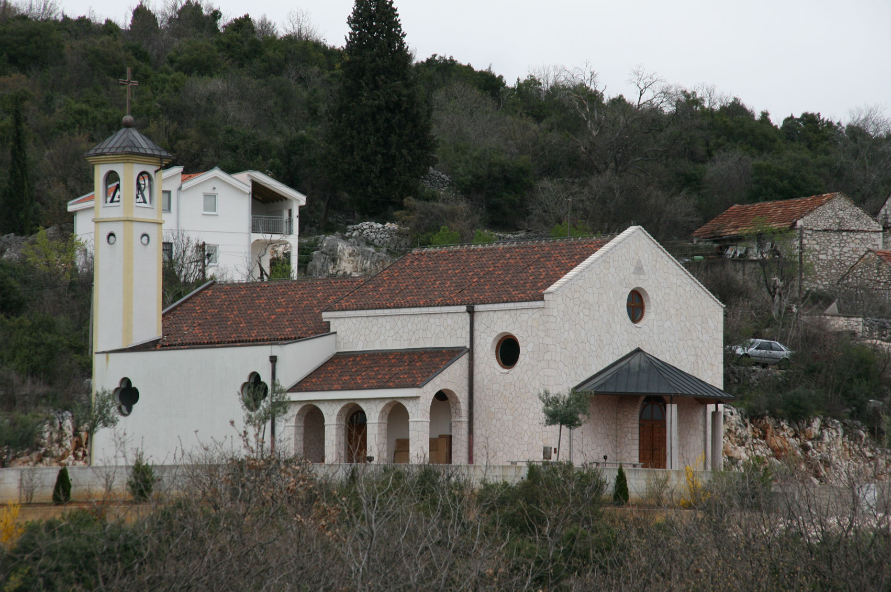

Chiesa realizzata con il contributo dell’associazione Fratello Mio ONLUS, presieduta dall’Arch. D. Colombini.

**_Progettazione:_** Arch. D. Colombini
**_Proprietà:_** Frati Francescani di Gradnici

#### Casa Magnificat, Medjugorje, Bosnia Herzegovina

Centro di accoglienza a disposizione delle persone che desiderano vivere un’esperienza nella spiritualità che si è manifestata nel corso di 29 anni di presenza e di messaggi ricevuti dalla Regina della Pace a Medjugorje.

**_Progettazione:_** Arch. D. Colombini
**_Proprietà:_** Famiglia Lunetti, Pavlovic

#### Oasi della Gioia, Civitavecchia, Roma

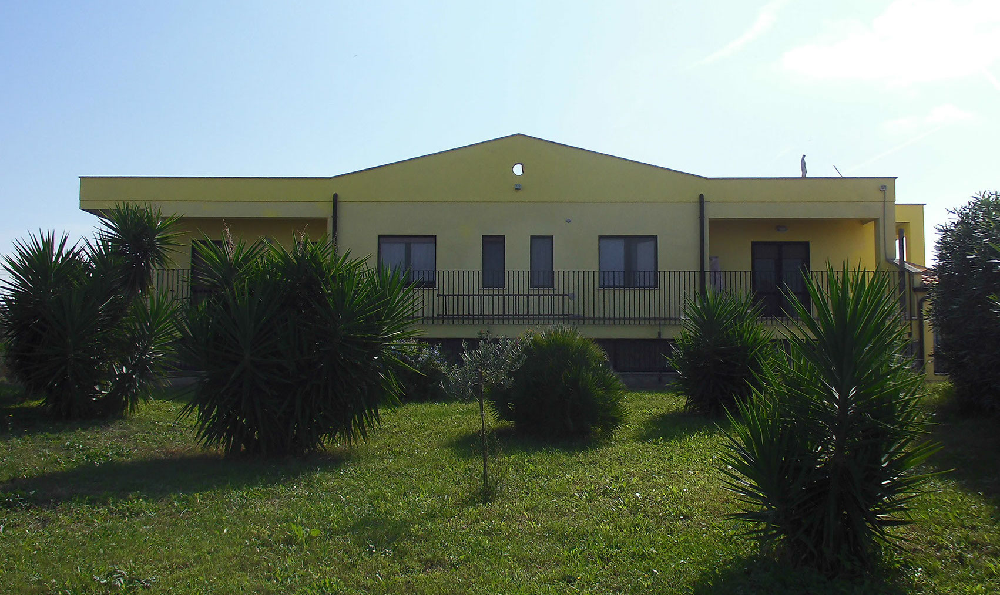

Casa di accoglienza per giovani e famiglie in difficoltà della Comunità Mariana, Missione Giovani, Civitavecchia.

**_Progettazione:_** Arch. D. Colombini
**_Proprietà:_** Comunità Mariana Missione Giovani
**_Referente:_** Padre Sergio Raiteri
